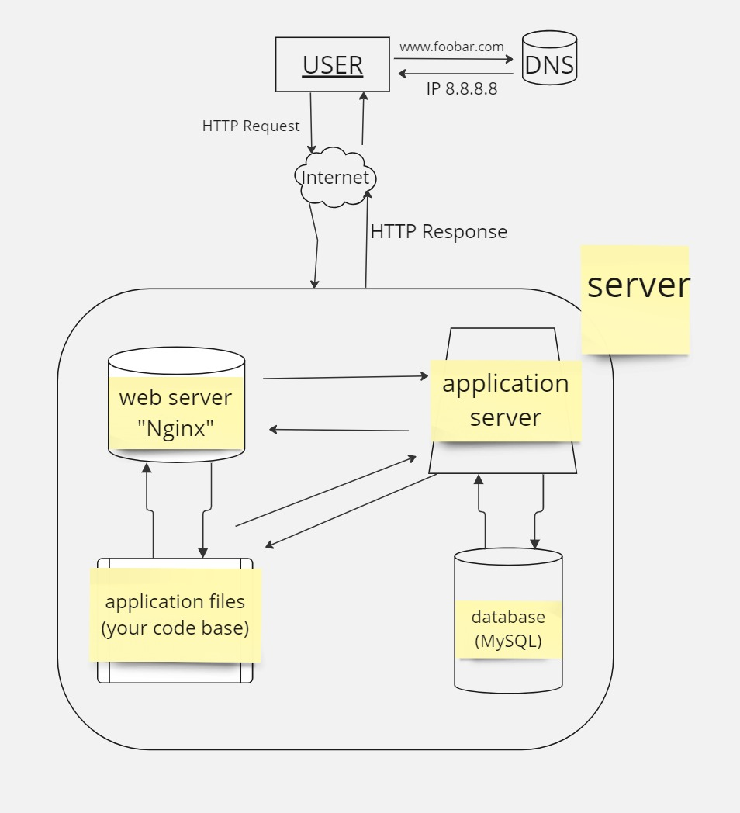

Simple Web Stack Design:

1-Server (8.8.8.8):

Physical or virtual machine hosting all components.
2-Domain Name (foobar.com):

Human-readable address for the website.
Configured with a CNAME record for the "www" subdomain pointing to 8.8.8.8.

3-Web Server (Nginx):

Handles incoming HTTP requests.
Serves static content.
Routes dynamic requests to the application server.

4-Application Server:

Hosts the application code base (e.g., PHP).
Executes application logic.
Generates dynamic content.

5-Database (MySQL):

Stores website data (e.g., user information, content).
Manages data retrieval and storage.

Specifics of the Infrastructure:

*What is a Server?

A server is a computer or system that provides resources or services to other computers, known as clients, over a network.

*Role of the Domain Name:

The domain name provides a human-readable address for the website, allowing users to access it easily.

*Type of DNS Record "www" in www.foobar.com:

The "www" subdomain is configured with a CNAME record, which is an alias for another domain name (8.8.8.8 in this case).

*Role of the Web Server:

The web server (Nginx) handles incoming HTTP requests, serves static content, and routes dynamic requests to the application server.

*Role of the Application Server:

The application server hosts the application code base, executes application logic, and generates dynamic content requested by users.

*Role of the Database:

The database (MySQL) stores and manages the website's data, such as user information and content.

*Communication between Server and User's Computer:

The server communicates with the user's computer over the Internet using the HTTP protocol, delivering requested web pages and resources.

Issues with this Infrastructure:
Single Point of Failure (SPOF):

If the server goes down, the entire website becomes inaccessible.

*Downtime During Maintenance:

Restarting the web server for maintenance can result in downtime, making the website unavailable to users.

*Limited Scalability:

A single server may struggle to handle a large volume of traffic efficiently, limiting the website's scalability.
