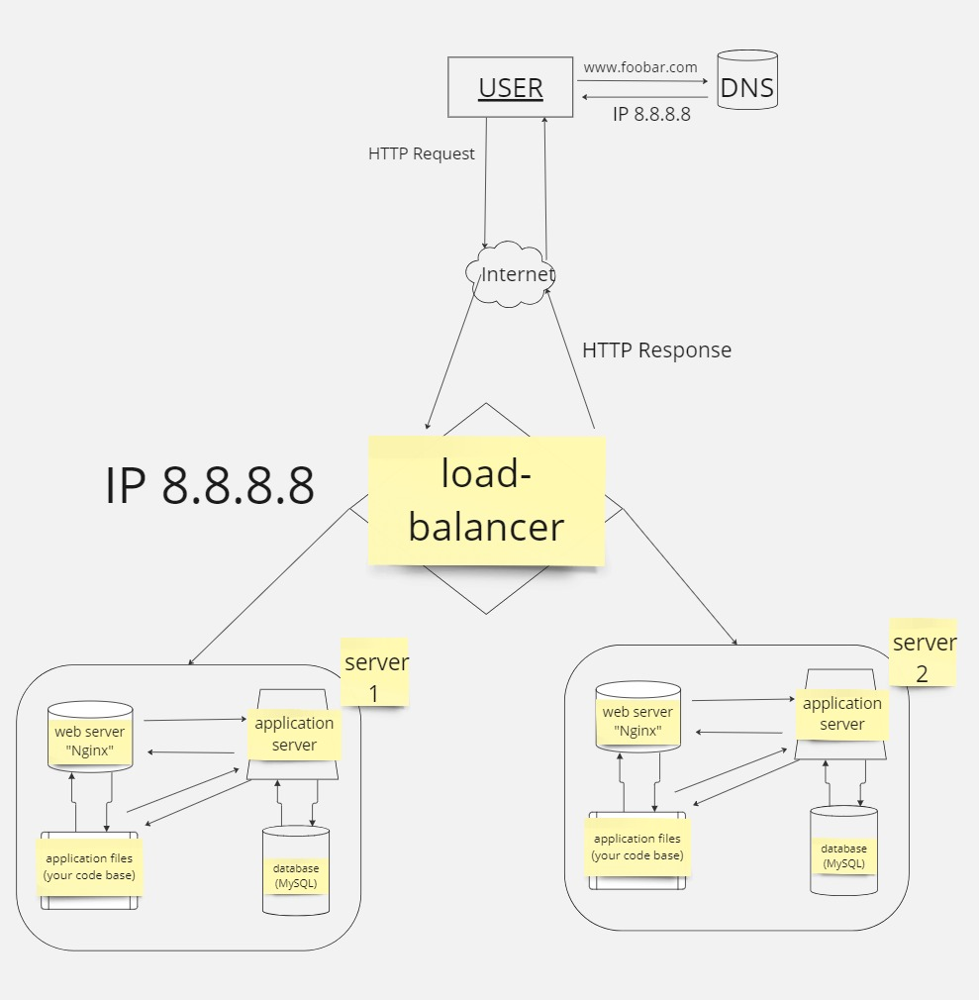

Distributed Web Infrastructure Design:

Load Balancer (HAproxy):

Distributes incoming traffic across multiple servers to improve performance and reliability.
Added to handle increased traffic and ensure high availability.
Web Servers (Nginx) - Server 1 and Server 2:

Hosts the website and serves web pages to users.
Two servers added for redundancy and load distribution.
Application Server:

Hosts the application code base.
Executes application logic and generates dynamic content.
Database (MySQL - Primary-Replica Cluster):

Primary node: Handles write operations and serves as the primary source of data.
Replica node: Replicates data from the primary node and handles read operations.
Ensures data redundancy, fault tolerance, and high availability.
Specifics of the Infrastructure:
Additional Elements and Reasons:

Load Balancer: Added to distribute incoming traffic evenly across multiple web servers, improving scalability and reliability.
Two Web Servers: Added for redundancy and load distribution, ensuring high availability and fault tolerance.
Primary-Replica Database Cluster: Implemented for data redundancy and fault tolerance, ensuring data availability and integrity.
Load Balancer Configuration:

The load balancer (HAproxy) is configured with a round-robin distribution algorithm, which routes incoming requests to each server in a circular order.
This algorithm evenly distributes the traffic load across all available servers.
Active-Active vs. Active-Passive Setup:

The load balancer enables an Active-Active setup, where both web servers are actively serving traffic simultaneously.
In an Active-Passive setup, one server remains idle until the primary server fails, leading to less efficient resource utilization.
Primary-Replica Database Cluster:

The primary node handles write operations and serves as the main source of data.
The replica node replicates data from the primary node and handles read operations, providing fault tolerance and data redundancy.
Difference between Primary and Replica Nodes:

The primary node accepts write operations and serves as the authoritative source of data for the application.
The replica node replicates data from the primary node and serves read operations, providing scalability and fault tolerance without impacting the primary node's performance.
Issues with this Infrastructure:
Single Point of Failure (SPOF):

The load balancer can become a single point of failure if it fails, causing disruption to incoming traffic.
Without redundancy or failover mechanisms, any component failure can impact the availability of the website.
Security Issues:

Lack of firewall protection exposes servers and data to potential security threats.
Absence of HTTPS encryption leaves data transmitted between servers and users vulnerable to interception and manipulation.
No Monitoring:

Without monitoring systems in place, it's challenging to detect and respond to performance issues, security breaches, or other anomalies effectively.
