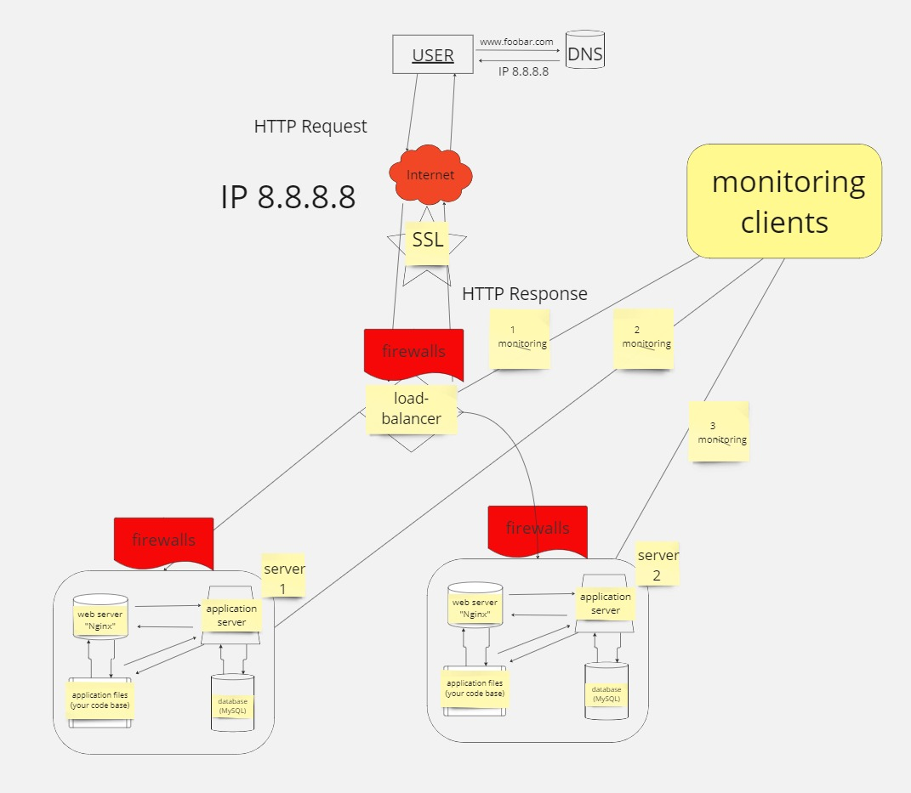

Three-Server Web Infrastructure Design:

Firewalls:

Added for network security to control incoming and outgoing traffic.
Protects servers from unauthorized access and potential threats.
SSL Certificate for HTTPS:

Enables secure communication between the server and clients by encrypting data.
Provides authentication and integrity, ensuring privacy and trust.
Monitoring Clients (Data Collectors):

Collects performance metrics, logs, and other data for monitoring and analysis.
Helps identify issues, optimize performance, and ensure system reliability.
Specifics of the Infrastructure:
Additional Elements and Reasons:

Firewalls: Added to secure the network perimeter and control traffic flow, preventing unauthorized access and potential threats.
SSL Certificate: Implemented to encrypt traffic between the server and clients, protecting sensitive data from interception and tampering.
Monitoring Clients: Deployed to monitor server performance, detect anomalies, and troubleshoot issues proactively.
Purpose of Firewalls:

Firewalls are used to filter incoming and outgoing network traffic based on predefined security rules.
They act as a barrier between the internal network and external networks, preventing unauthorized access and malicious activities.
Traffic Served over HTTPS:

HTTPS encrypts data transmitted between the server and clients, ensuring privacy and data integrity.
It protects sensitive information such as login credentials, payment details, and personal data from eavesdropping and tampering.
Purpose of Monitoring:

Monitoring is used to track the performance, availability, and security of the web infrastructure.
It helps identify issues, optimize resource usage, and ensure smooth operation of the system.
Data Collection by Monitoring Tool:

The monitoring tool collects data from various sources, including server logs, performance metrics, and network traffic.
It aggregates and analyzes the data to generate insights and alerts for monitoring and troubleshooting purposes.
Monitoring Web Server QPS:

To monitor web server QPS (Queries Per Second), you can configure the monitoring tool to track the number of HTTP requests processed by the web server over time.
By analyzing QPS metrics, you can identify traffic patterns, detect anomalies, and optimize server performance.
Issues with this Infrastructure:
Terminating SSL at the Load Balancer Level:

Terminating SSL at the load balancer exposes decrypted traffic within the internal network, potentially compromising data security.
It's recommended to offload SSL decryption to the web servers to maintain end-to-end encryption and protect sensitive data.
Single MySQL Server Accepting Writes:

Having only one MySQL server capable of accepting writes creates a single point of failure.
If the server fails, it can result in data loss or downtime, impacting the availability and integrity of the application.
Uniformity of Server Components:

Having servers with all the same components (database, web server, and application server) increases the risk of uniform failures.
Diversifying server components helps mitigate risks associated with component-specific failures.
