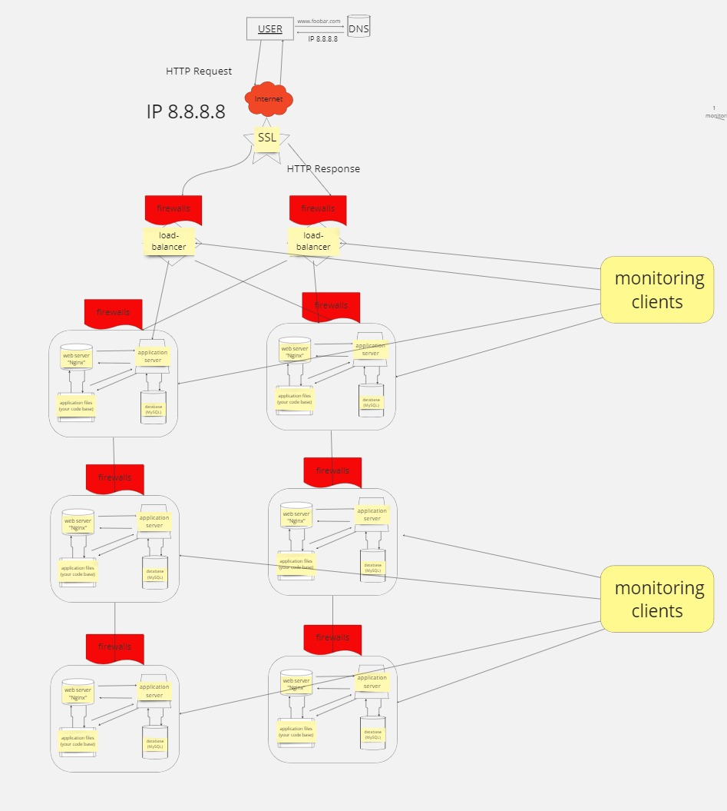

Scale Up - Infrastructure Enhancement

Components:
Server:

An additional server has been added to the infrastructure to handle increased workload and improve redundancy.
Load Balancer (HAproxy):

HAproxy has been configured as a cluster with the existing load balancer to distribute traffic across multiple servers for load balancing.
This improves scalability, fault tolerance, and performance by distributing incoming requests evenly.
Split Components:

Components such as the web server, application server, and database have been split onto separate servers.
This allows for better resource management, isolation, and scalability as each component can scale independently based on its specific requirements.
Specifics:
Why Adding Another Server?

Additional server(s) are added to handle increased traffic and distribute the workload effectively.
This improves redundancy and fault tolerance by spreading the workload across multiple servers.
Why Configuring HAproxy as a Cluster?

HAproxy is configured as a cluster to ensure high availability and fault tolerance.
Multiple load balancer instances work together to distribute traffic, improving scalability and performance.
Why Splitting Components onto Separate Servers?

Separating components onto dedicated servers improves scalability, isolation, and resource utilization.
Each component can scale independently based on its specific requirements without impacting other components.
Conclusion:
Enhancing the infrastructure with an additional server, configuring HAproxy as a cluster, and splitting components onto separate servers improves scalability, fault tolerance, and performance. This setup ensures the infrastructure can handle increased traffic and maintain high availability even during peak loads.

Additional Notes:
For detailed instructions on setting up the infrastructure and configuring HAproxy as a cluster, please refer to the documentation provided with your server and load balancer software.
Make sure to monitor the performance and health of your infrastructure regularly to ensure optimal operation.
Author:
[Zakaria Derkaoui]
